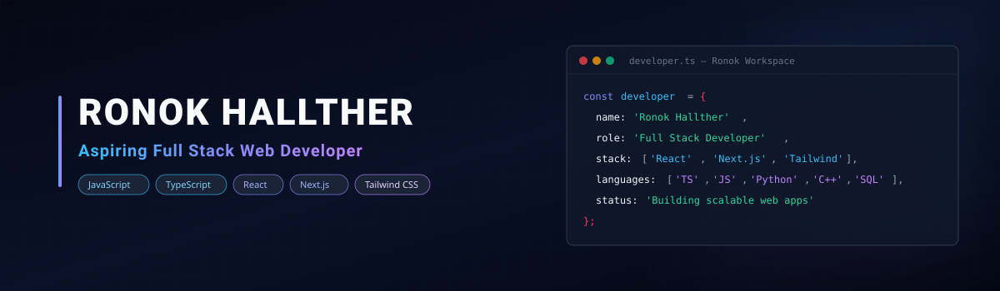

  

# Hey 👋, I'm Ronok Hallther!

I'm an **Aspiring Full Stack Web Developer 🌐** passionate about building modern, user-friendly web applications. I enjoy working with **JavaScript, React, Next.js, and modern web technologies** while continuously exploring new tools and frameworks. 💻

I love learning by building real-world projects, solving problems, and turning ideas into practical applications. 🚀

### 🧐 More About Me:

* 🌱 Currently learning and strengthening my skills in **JavaScript, TypeScript, React, Next.js**.
* 💻 Focused on growing as a **Full Stack Web Developer** by building practical, real-world applications.
* 🛠️ Enjoy working with **APIs, component-based development, responsive UI, and modern web technologies**.
* 🧩 I believe in **learning by building**, experimenting with new technologies, and continuously improving my problem-solving skills.
* 🎓 My university final-year project was a **Real-Time Face Recognition & Liveness Detection Attendance System**, developed using **Python, OpenCV, Haar Cascade, LBPH, KNN, Tkinter, and MySQL**.
* 🚀 Currently working toward becoming a confident **Full Stack Developer** and contributing to meaningful software projects.
* 🤝 Open to **learning, collaboration, and opportunities to work on interesting web development projects**.

### 🛠️ Languages and Tools:

#### 💻 Languages

#### 🌐 Web Development

#### 🗄️ Database & Backend

#### 🔧 Tools & Platforms

### 📊 GitHub Stats

  
  

  

